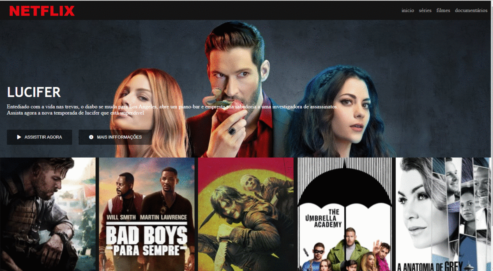

<h1 align="center">
    interface-netflix
</h1>

        This is a netflix clone to exercise knowledge and learn more and more.

<h2 align="center">
Resources
</h2>
<ol>
    <li>HTML</li>
    <li>CSS</li>
    <li>Font awesome</li>
    <li>Java script</li>
    <li>Jquery</li>
</ol>
<h2 align="center">Start Dev Environment
</h2>
<ol>
    <li>open git-bash and clone the repository</li>
    <li>Open project folder in VSCode</li>
    <li>Right click index.html > Open with Live Server</li>
    <li>access in your browser and look at the clone and if you find something that can improve do it!</li>
</ol>

​           

